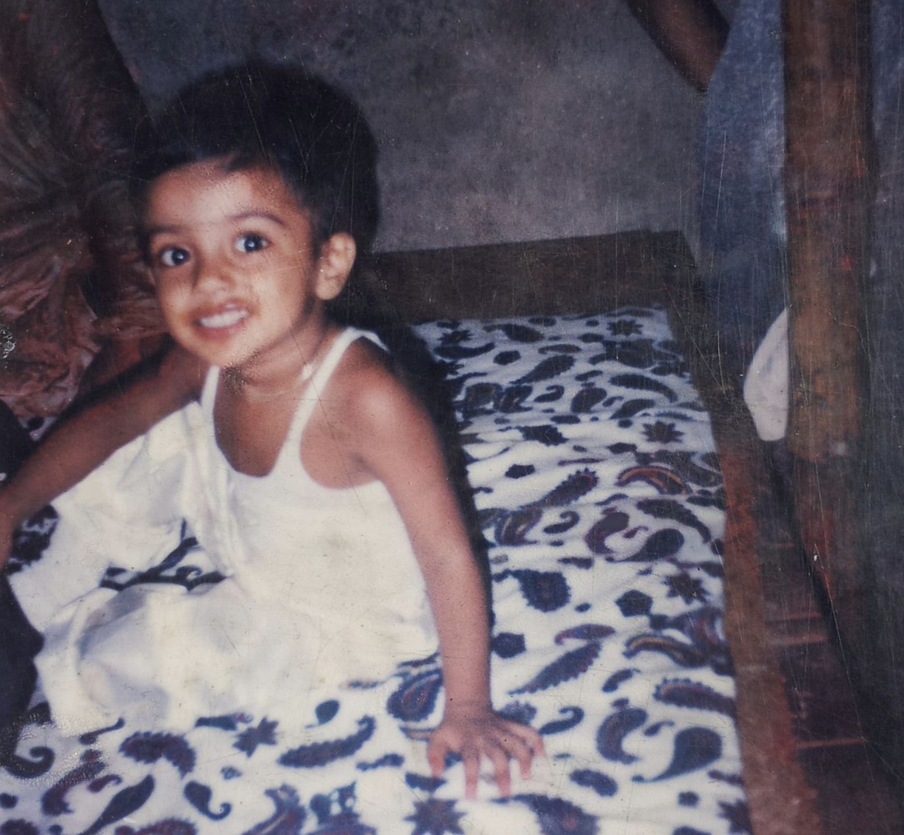
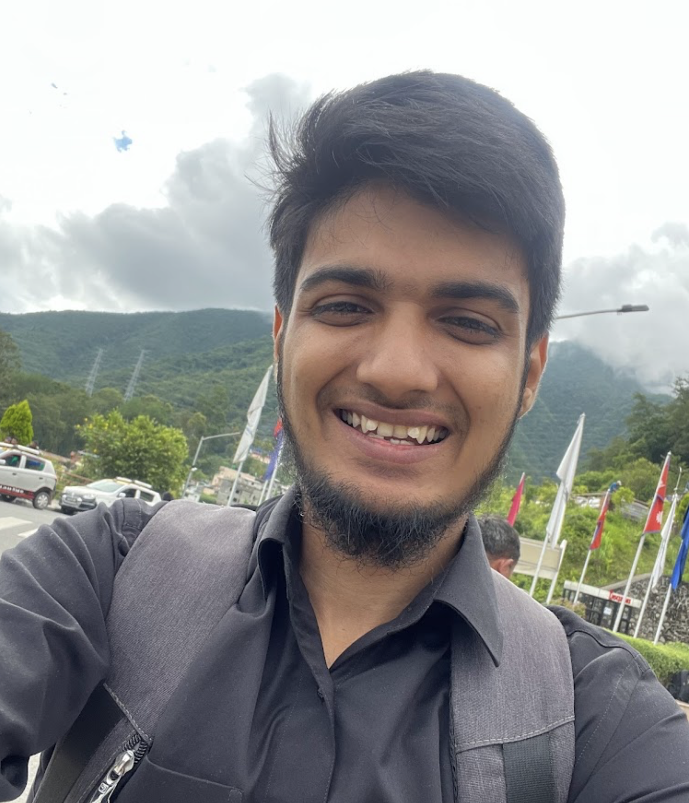
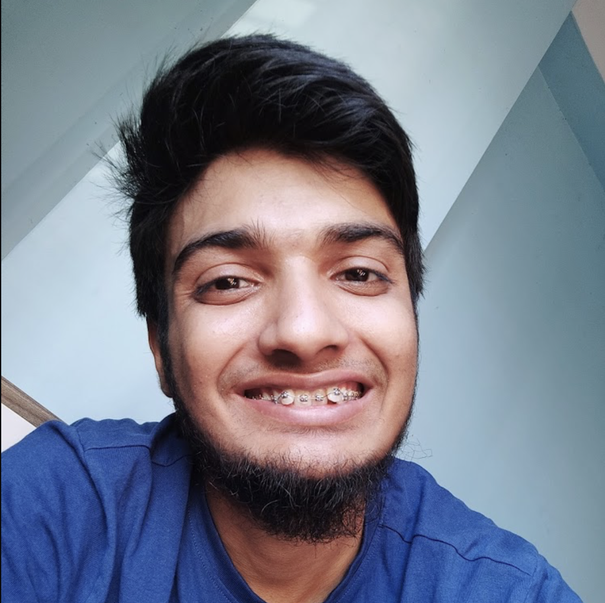
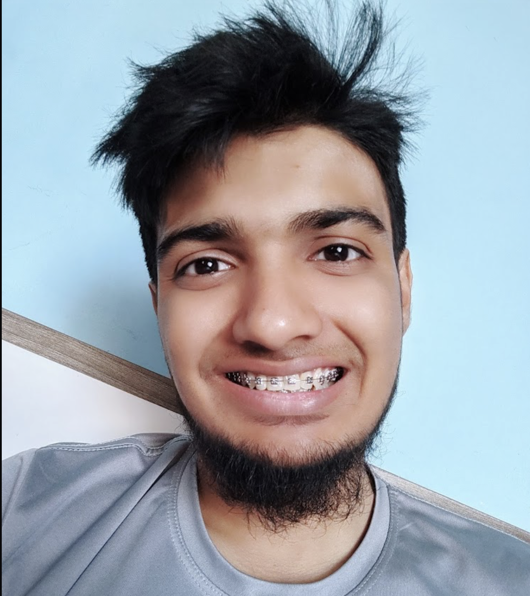
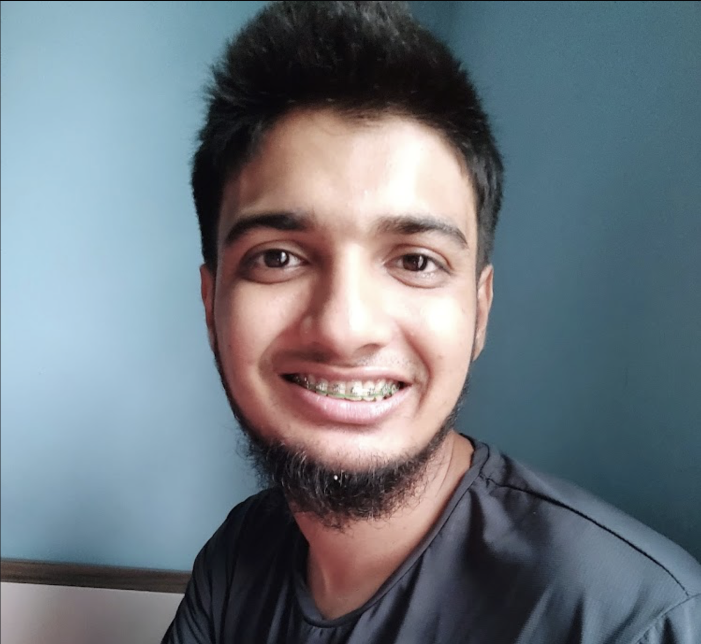
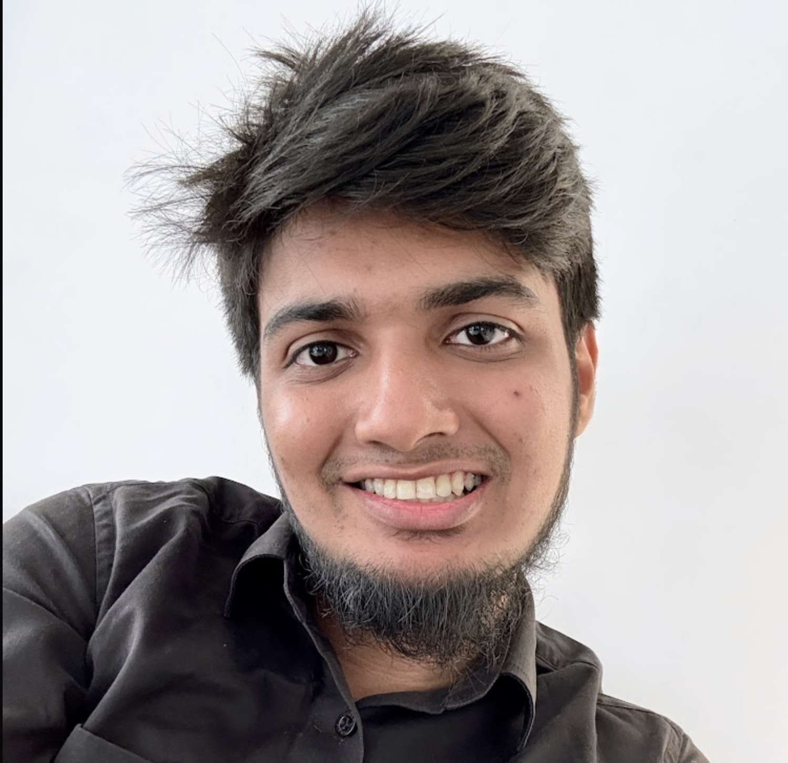

In my childhood, I had straight teeth, and I always used to smile a lot with my teeth showing. However, I only have one photo of it.

I have some interesting stories about how I lost my baby teeth. One time, I bit into the white part of a coconut, and my tooth got stuck and pulled out. On another occasion, I was biting down on a towel when one of my cousins snatched it away, causing me to lose a few more teeth. New teeth grew in, but probably in kindergarten, I lost a few more teeth, and the new ones that came in were not straight. Suddenly, I had crooked teeth, and two of my front teeth were severely crooked, which caused me a lot of issues. I was constantly cutting my lips and would get severe injuries from those cuts. As time went on, I got used to the cuts, and the number of cuts slowly decreased but never went to zero. Or maybe I just got used to it.

When I first noticed my crooked teeth, I always wanted to get them straightened, but I was a kid and didn't have the power to go to the dentist for that. I probably learned from my mom that there are ways to straighten them using some wire or something. I always dreamed of getting them straightened.

Fast forward to university life when I had money but was still not considering getting braces, probably due to the issue of it not being Halal. However, I saw Mufti Menk with braces and learned that if I'm not doing it just for cosmetic purposes, then it is not prohibited. Yet, I was still hesitant because it is mostly a lifelong commitment. As time passed, I began to notice more issues with my dental health, especially since I almost never used my front teeth. Thinking about my future old age, I started researching for months and finally decided to get braces.  
I started searching for the best dental office around me, but at the time, I was living in Rupganj, Narayanganj near my campus 70% of the time and 30% in Dhaka with my family. However, searching online (hmm, that’s the only tool I have) and around Dhaka, close to my family home, I couldn’t find any dental office that had an orthodontic program. Also, in Narayanganj, there were none around me as well. So, searching online, I ended up choosing [Promident Dental Clinic](https://www.promidentdental.com) in Banani, which is easier to reach from my campus.

I went for my first appointment, and they told me to come back with an x-ray the next week, which I did. They took some measurements and asked me to come again the following week. In the next appointment, the doctor sat with me and mentioned that I might need to undergo tooth extraction to get things 100% straightened. However, I refused to go that route and chose to have nearly straightened teeth while keeping all my teeth intact. The doctor partially agreed and mentioned that we might need to extract in the middle of the treatment, but we most probably won't have to do that.

Regarding options, there were three: traditional braces, self-ligating braces, and **Invisalign**. I went with self-ligating braces, which would cost around 165K over the span of 1 and a half years. So finally, in mid-July'23, I got my braces on!

The first few weeks were very painful and uncomfortable, and I thought it would be a nightmare to endure this for the next 1.5 years! But as time went on, I started to feel normal, and only every 3 weeks would the braces be adjusted, which would bring back pain for a few days and then return to normal. In the beginning, I noticed a huge shift in my teeth. After about half a year, things were almost there.

And after one year passed, things were pretty good already. But it was only for the upper jaw; for the lower jaw, I got braces after about 4 months, and it took a while for those to get close to straight.

And finally, in February'25, I got my braces off!

Now I no longer have braces and have nearly straight teeth. However, I’ll have to wear a retainer every night for 2 more years to ensure they stay straight without returning to their original position.